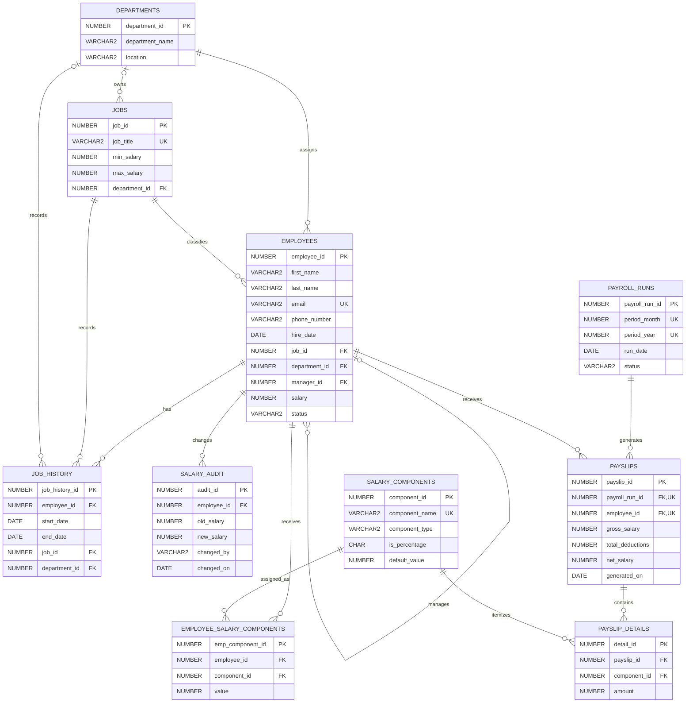

# HR System ER Diagram

```mermaid
erDiagram
    DEPARTMENTS {
        NUMBER department_id PK
        VARCHAR2 department_name
        VARCHAR2 location
    }

    JOBS {
        NUMBER job_id PK
        VARCHAR2 job_title UK
        NUMBER min_salary
        NUMBER max_salary
        NUMBER department_id FK
    }

    EMPLOYEES {
        NUMBER employee_id PK
        VARCHAR2 first_name
        VARCHAR2 last_name
        VARCHAR2 email UK
        VARCHAR2 phone_number
        DATE hire_date
        NUMBER job_id FK
        NUMBER department_id FK
        NUMBER manager_id FK
        NUMBER salary
        VARCHAR2 status
    }

    JOB_HISTORY {
        NUMBER job_history_id PK
        NUMBER employee_id FK
        DATE start_date
        DATE end_date
        NUMBER job_id FK
        NUMBER department_id FK
    }

    SALARY_AUDIT {
        NUMBER audit_id PK
        NUMBER employee_id FK
        NUMBER old_salary
        NUMBER new_salary
        VARCHAR2 changed_by
        DATE changed_on
    }

    SALARY_COMPONENTS {
        NUMBER component_id PK
        VARCHAR2 component_name UK
        VARCHAR2 component_type
        CHAR is_percentage
        NUMBER default_value
    }

    EMPLOYEE_SALARY_COMPONENTS {
        NUMBER emp_component_id PK
        NUMBER employee_id FK
        NUMBER component_id FK
        NUMBER value
    }

    PAYROLL_RUNS {
        NUMBER payroll_run_id PK
        NUMBER period_month UK
        NUMBER period_year UK
        DATE run_date
        VARCHAR2 status
    }

    PAYSLIPS {
        NUMBER payslip_id PK
        NUMBER payroll_run_id FK, UK
        NUMBER employee_id FK, UK
        NUMBER gross_salary
        NUMBER total_deductions
        NUMBER net_salary
        DATE generated_on
    }

    PAYSLIP_DETAILS {
        NUMBER detail_id PK
        NUMBER payslip_id FK
        NUMBER component_id FK
        NUMBER amount
    }

    DEPARTMENTS ||--o{ EMPLOYEES : assigns
    JOBS ||--o{ EMPLOYEES : classifies
    DEPARTMENTS o|--o{ JOBS : owns
    EMPLOYEES o|--o{ EMPLOYEES : manages
    EMPLOYEES ||--o{ JOB_HISTORY : has
    JOBS ||--o{ JOB_HISTORY : records
    DEPARTMENTS o|--o{ JOB_HISTORY : records
    EMPLOYEES ||--o{ SALARY_AUDIT : changes
    EMPLOYEES ||--o{ EMPLOYEE_SALARY_COMPONENTS : receives
    SALARY_COMPONENTS ||--o{ EMPLOYEE_SALARY_COMPONENTS : assigned_as
    PAYROLL_RUNS ||--o{ PAYSLIPS : generates
    EMPLOYEES ||--o{ PAYSLIPS : receives
    PAYSLIPS ||--o{ PAYSLIP_DETAILS : contains
    SALARY_COMPONENTS ||--o{ PAYSLIP_DETAILS : itemizes
```